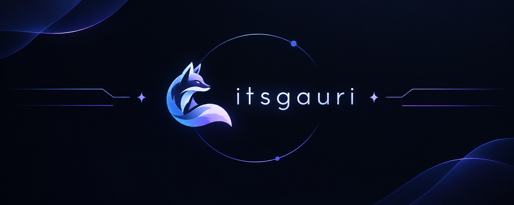

  

# Heyy there👋
<!--
**itsgauri06/itsgauri06** is a ✨ _special_ ✨ repository because its `README.md` (this file) appears on your GitHub profile.
-->
Welcome to my little corner of the internet! ✨

I'm a Computer Engineering student and a curious learner who loves exploring and trying out different things.

Currently, I'm exploring **backend development, AI, LLMs, and core computer science**, while building projects along the way.

I like learning by actually building things — getting stuck, figuring out why something broke, fixing it, and hopefully making it a little better the next time around. 🚀

Still learning. Still experimenting. Still figuring things out.

- 😄 Would love to collaborate on projects and hackathons
- 🎮 Hobbies: Painting and journaling
- 🔭 I’m currently working on making new projects
- 🌱 I’m currently learning how LLMs actually work
- ⚡ Fun fact: I enjoy listening to lo-fi music

